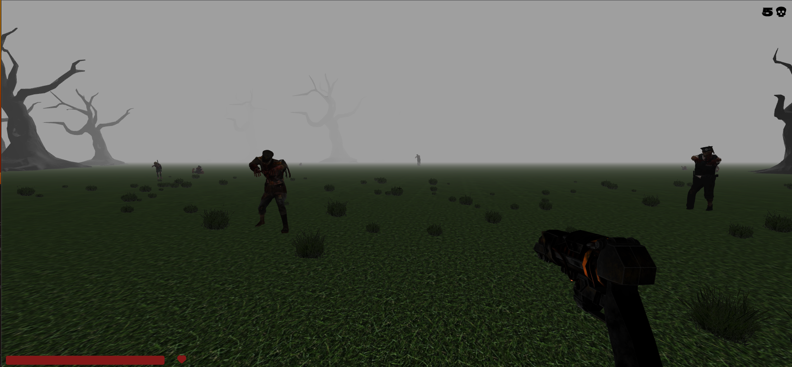

# Fog of the Dead
Fog of the Dead is a FPS game utilizing threejs. The player stands in the middle of a foggy forest as zombies approach on all sides. The goal is to kill as many zombies as the player can before the player health drops to zero. The goal of this project was to turn around an MVP for a client requesting the game within two days

## Table of Contents
- [Tech Stack](#tech-stack)
- [Gameplay](#gameplay)
- [Contributors](#contributors)
- [Resources](#resources)

## Tech Stack

## Gameplay

## Contributors

## Resources
Music: [Serge Quadrado](https://freemusicarchive.org/music/serge-quadrado/)